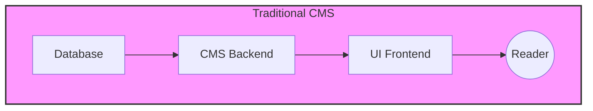
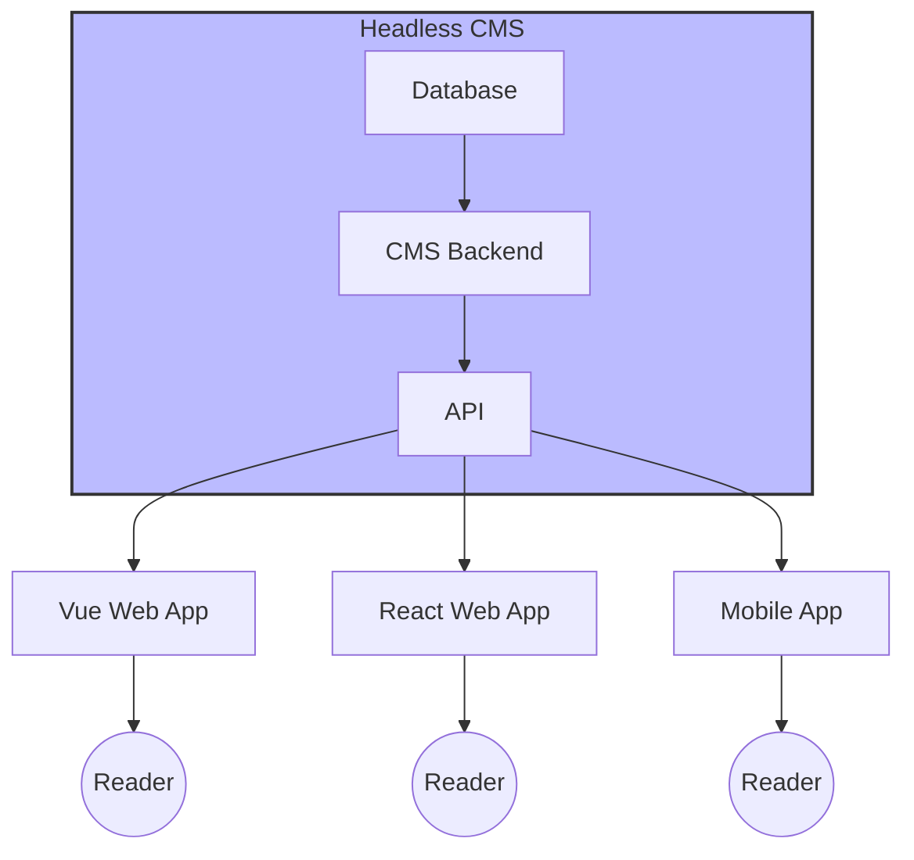

# Template Headless CMS

The title of this readme is a little misleading. This repository is a template for a headless content management system (CMS) with a starter frontend framework.

The 'headless' CMS, in this case, is built with [Strapi](https://strapi.io) (open-source) and the frontend is built with [Nuxt](https://nuxt.com), a frontend javascript framework (open-source).

Why build a 'wrapper' over an existing headless CMS and call it a 'template'?

- a headless CMS still needs a 'frontend'
- implementing the connection between the frontend (Nuxt) and backend (Strapi) is complex and time-consuming to get started with

## Getting Started

> [!TIP]
> The order that you get started in **matter**. The backend should be up and running before you get started with the frontend.

1. Visit [`src/backend`](./src/backend/README.md) to get started with the CMS
2. Visit [`src/frontend`](./src/frontend/README.md) to get started with the frontend

## Usage

Once you have the `frontend` and `backend` setup, you can start using this template as follows:

1. Define schemas in the `backend` via the Content-Type Builder
2. Create some content in the `backend` via Content Manager
3. Implement some API calls via [`src/frontend/server`](src/frontend/server) in the `frontend` to fetch the content in the `backend`
4. Display the content

## FAQ

### What is a Headless CMS?

A traditional CMS manages both backend (data, logic) and frontend (UI), making it harder to decouple content from presentation.

A headless CMS, like Strapi, only manages the backend and exposes content via an API. You can use any frontend technology to consume the API.

In summary: A headless CMS lets you manage content in one place and deliver it anywhere, using any frontend framework you prefer.
